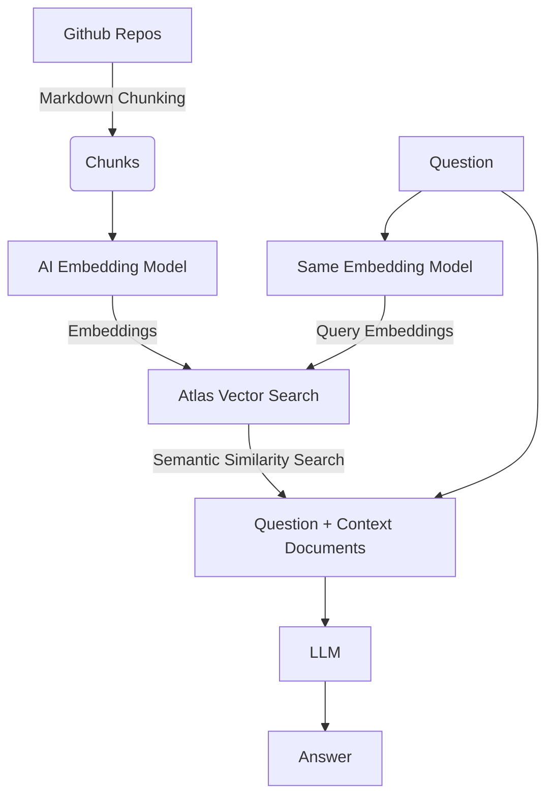

# oss-repo-recommender

```mermaid
graph TD
    A[Github Repos] -->|Markdown Chunking| B(Chunks)
    B --> C[AI Embedding Model]
    C -->|Embeddings| D[Atlas Vector Search]
    E[Question] --> F[Same Embedding Model]
    F -->|Query Embeddings| D
    D --> |Semantic Similarity Search| H[Question + Context Documents]
    E -->  H
    H --> I[LLM]
    I --> J[Answer]
```
